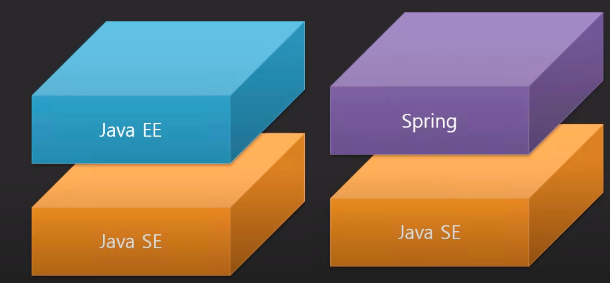

# spring framework

## prologue

* Dependency Injection

일반적인 응용프로그램을 만들 때는 중요하지 않을 수 있다. Enterprise용 어플리케이션을 만드는 경우, DI는 매우 중요하다.

* Transaction Management

jdbc라이브러리를 사용해서 트랜잭션을 관리할 수도 있다고 생각하겠지만, DAO, ServiceLayer를 만들게 되면, 커넥션이 끊어지는 함수들을 묶어서 하나의 트랜잭션을 관리해야 하는 경우가 생긴다.

service 계층을 이용해 service 함수들을 나누면, jdbc에서 제공하는 connection을 공유하기가 어렵다.

그런 경우, **jdbc 자체의 기능으로서의 transaction관리는 불가능**하다.

`스프링`은 단순히 라이브러를 사용하는 것으로 깔끔하게 `트랜잭션을 처리`해준다. 또한 `DI를 쉽게 구현`할 수 있게 해서 모듈을 쉽게 결합되도록 한다.

* `JAVA EE` : 분산형, 기업형 응용 프로그램 개발을 위한 API, 결합력을 낮추는 DI, DB 트랜잭션 처리, 로그처리

* `JAVA SE` : 일반적인 로컬 응용 프로그램 개발을 위한 API, 파일 I/O, 콘솔 I/O, 윈도우 I/O, 네트워크 I/O, Thread ...

과거에는 EE를 사용해 웹개발을 하거나 분산 응용프로그램을 만들거나 했다. 하지만 Spring이 탄생해 EE의 주무기들을 깔끔하고 쉽게 처리할 수 있으면서 EE가 갖고있던 모든 기능을 커버했다. 

때문에 어느순간부터 SE에 EE를 얹지 않고, spring을 얹어서 사용하게 된 것이다.

`더욱이 EE가 유료화`되고, 사용이 불편해져, 일반적으로 spring을 사용하게 된 것이다. 

`자바를 사용해 웹 개발을 한다고 하면, spring을 사용한다고 보면 된다.`

## Spring

스프링을 이용해 웹 개발을 한다고 하면 3가지 범주를 생각해볼 수 있다.

* Web MVC ← DI ← understanding of lose bond and interface
* Transaction ← AOP
* Authentication & Authorization ← Servlet Filter

