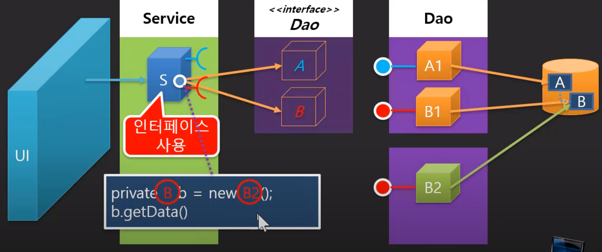

# understanding of lose-bond and interface

## Enterprise Application 제작

### 1. 기존 EA의 기본 레이어 구조와 한계

엔터프라이즈 어플리케이션을 제작할 때 우리는 기본적으로 다음과 같은 레이어를 사용한다.


* `UI` : 사용자측 

* `Service 레이어` : 사용자의 비지니스에 맞는, 요구에 맞는 서비스를 담당하고 있는 레이어

* `DAO` : Datasource에 접근하는 방법, 구현 기술 등을 숨기고 단순히 Service에서 Java Code를 통해 데이터를 제공받을 수 있도록 해주는 Data Access Object가 있다.

만약 DAO 부분에서 수정이 발생할 때, B1에 대해서 수정을 하거나, B2라는 새로운 DAO 객체를 만들어 처리를 할 수 있다.

B2를 새로 만드는 방법이 있다. B2를 새로 만들게 되면, 또 Service를 수정해야 하는 일이 생기게 된다. 다음과 같이.

```java
private B1 b = new B1();
b.getData();
```
↓ ↓ ↓ ↓ ↓ ↓ ↓ ↓ ↓ ↓ ↓ ↓ ↓ ↓ ↓ ↓ ↓ ↓ ↓ ↓
```java
private B2 b = new B2();
b.getData();
```

이렇게 되면 결국 수정에 대한 범위가 바꼈을 뿐, 달라진 게 없다.

B2가 추가됐을 때, Service레이어에서는 B2에 대한 정보를 가져와서 수정을 해야만 하기 때문에, `결합력이 높다고 볼 수 있다`.

### 2. interface의 도입, 결합력 낮추기


그럼 이걸 어떻게 할까? 

덮어쓰기를 하되, 가능한 수정은 없도록 해야한다.

---

어떻게 해야 결합력을 낮출 수 있을까? 

수정이 용이할 수 있을까?

우리가 사용하는 자료형을 `B1, B2로 나누는 게 아니라`, `B로 정의`해보자. 

우리가 B2를 따로 만든 건, B1에서 함수의 내부적인 코드가 조금 달라진 것 뿐이었다.

B2는 B1에서 조금 변형이 있을 뿐 근본적인 서비스는 똑같다.

때문에 B1, B2 클래스 명을 거론할 필요 없이 `기능의 줄에서만 사용할 수 있는 자료형(B)로 바꾸는 게 좋다`. 그게 바로 `interface`이다.



결국, `자료형은 A,B`를 쓰고, `A1, B1, B2 각각이 해당 자료형들을 구현`하는 것이다.

`이렇게 B라는 참조형 자료형을 이용함`으로써, `결합력을 낮춰놓았다`.

### 3. 

이렇게 interface를 이용해서 결합력을 낮추었지만, 문제는 객체를 생성하는 부분에서 B1, B2각각을 만드는 것에 대해서는 어떻게 처리를 해야할까?

즉, 위의 Service 레이어와 A1, B1, B2 각각을 어떻게 결합시킬 것인가?

바로 UI 레이어가 해당 작업을 담당한다.

```java
B b = new B1();
service.setB(b);
```
위 코드의 B1을 B2로 바꾸는 작업이 필요하다. 하지만 해당 작업을 `소스코드 없이 돌아가도록 해야 한다`.

그러한 작업을, 생성할 객체를 `객체의 생성과 조립을 위한 외부 설정` (e.g. XML, Annotation ...)에 두고 그들에 의해서 객체가 생성될 수 있도록 해주는 것이다.


