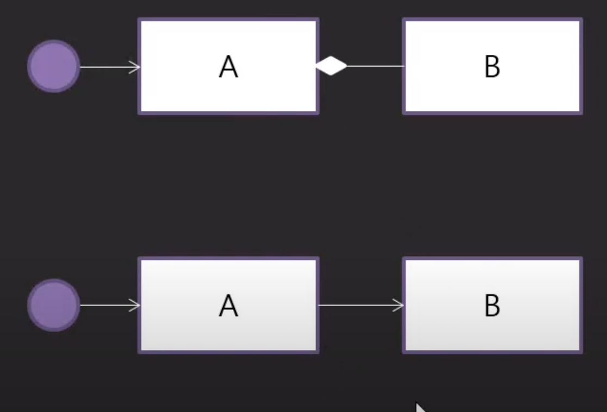
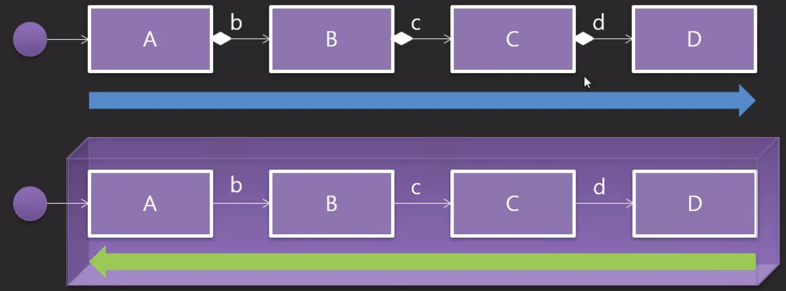

# DI & IoC Container

## DI (Dependency Injection)

우리가 프로그램을 만들 경우, 특히 객체지향(OOP)으로 만들 경우에, 프로그램은 객체들의 조립 관계에 의해서 만들어지게 된다.

### Dependency 관계란?

```java
class A {
    private B b;
    
    public makeB() {
        b = new B();
    }
}
```

위의 경우를 A가 B를 일체형으로 가졌다고 해서 일체형 `Composition has-a` 관계라고 한다. 

이러한 관계에서는 B가 A의 부품이라고 할 수 있다. 

혹자는 이러한 관계를 `dependency`라고 한다. 이를 번역해서 종속성, 의존성이라고 부르곤 한다.  

```java
class A {
    private B b;
    
    public void setB(B b) {
        this.b = b;
    }
}
```

첫번 째 붙박이형과는 달리, 위의 경우, 조립형으로 세팅을 해야 사용할 수 있다. 

### 스프링에서의 DI

스프링을 사용할 때, DI가 중요하다고 하는데 왜 DI가 중요하냐, DI가 왜 스프링을 중요하게 만들었느냐를 알아보자.



B에 변경사항이 생길 경우, 보다 느슨한 결합인 조립형 관계가 더 적합하다고 볼 수 있다. 

특히, 일반적인 어플리케이션이 아닌, 기업형 어플리케이션의 경우, 더욱 느슨한 관계를 추구한다.

```java
B b = new B(); //dependency
A a = new A(b); //생성자를 통해 inject
a.setB(b); // setter를 통해 inject
```

---

* Setter Injection
```java
B b = new B();
A a = new A();
b.setA(a);
```
* Construction Injection
```java
B b = new B();
A a = new A(b);
```

이러한 조립형 관계에서 조립하는 행위(DI)를 대신 해주는 서비스를 받을 수 있다. 

그러한 서비스를 통해 시간도 절약할 수 있고, 조립하는 것의 불편함을 겪을 필요가 없다.

이러한 행위를 대신 해주는 도구가 `Spring`이다.

Spring이 제공하는 가장 대표적인 기능 중 하나가 Dependency Injection이 되겠다.

## IoC Container

Spring의 코어 기능에 Dependency Injection이 있다는 것을 알았다.

이 Spring이 어떠한 부품이 필요하고, 그 부품들이 어떠한 조립관계를 가져야 한다는 것을 명세화 할 수 있어야 한다.

Spring을 통해서 우리가 만들고자 하는 소프트웨어는 `XML파일과 Annotation을 통해서 조립관계를 명세화`한다.

### Container

Spring에서는 객체를 생성해서 담을 수 있는 그릇이 필요한데, 소프트웨어에서는 일반적으로 그러한 그릇들을 Container라고 한다.

그런 컨테이너에 어떤 것들이 담겨져있는가에 따라 XXContainer라고 한다.

그럼 부품들을 담는 부품 Container가 적합한 말일 것 같지만, 스프링에서는 `IoC Container`라고 한다.



위의 일체형의 경우, 사용자가 A라는 객체를 가장 먼저 만들고, A에서 B를 만들고 ... C에서 D를 만드는 순서로 생성이 된다.

하지만, 스프링과 같이 결합형으로 프로그램이 만들어지는 경우, D가 만들어진 다음 C에 결합되고 ... B가 만들어진 다음 A에 결합되는 역순 방식이다.

스프링에서는 역순으로 객체들이 생성되기 때문에 Inversion Of Control이라고 부른다.

dependency를 담고 있는 것이지만, 역순으로 조립된 객체들을 담고 있기에 IoC Container라고 부른다.

단순히 제어의 역전이라는 의미에서 IoC가 아님.
